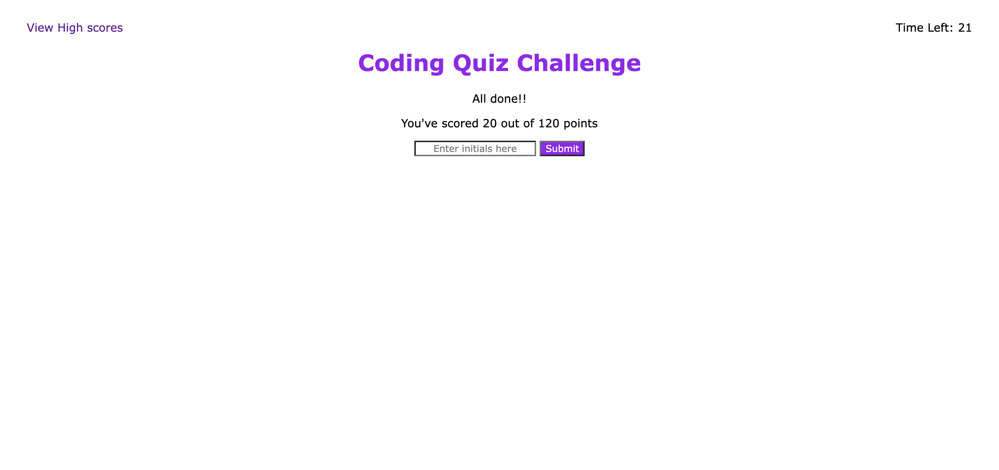

# 04 Web APIs: Code Quiz

The project is a timed code quiz containing six questions testing the users knowledge of Javascript. It was built from scratch using HTML, CSS and Javascript.

The quiz:
<li> has a timer that starts counting down from 75 seconds once the Start Button is clicked. </li>
<li> displays the first question once the Start Button is clicked </li>
<li>allows the user to select an answer with a mouse click, and checks the answer </li>
<li> adds 20 points to the user's score for each correct answer, and subtracts 10 seconds from the time remaining whenever the user chooses an incorrect answer.</li>
<li> takes the user to the end screen when the timer runs out, or when the user has run out of questions </li>
<li> displays the user's score on the end screen </li>
<li> allows the user to save their score and initials by using Local Storage. This can be viewed on the High Scores Page</li>
<li> allows the user to clear their score </li>

The user can view whether their answer is incorrect/correct by viewing the console. The console log will display 'wrong' or 'correct' depending on the user's answer.

The application can be viewed here : <a href="https://ekubik.github.io/week-four-code-quiz/index.html"> https://ekubik.github.io/week-four-code-quiz/index.html </a>

 
 

<strong> Comments: </strong>
Currently, the quiz only stores the most recent initials and score. In order to store multiple values, we would need to create an object, and pass through stored values using a loop.
